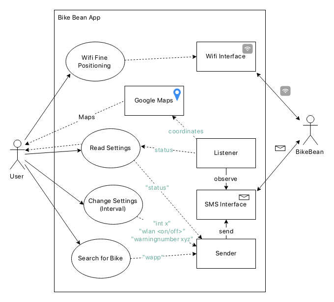
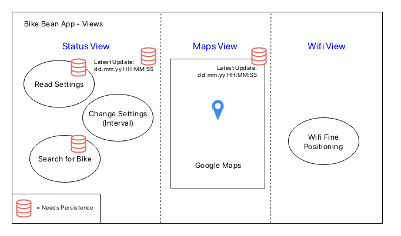
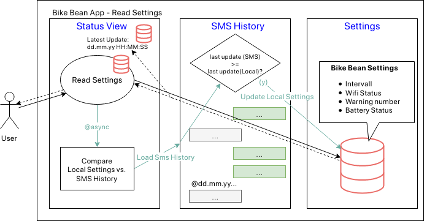

# Technical Overview

## Use Cases

## Views

## Detailed Use Cases

### Read Settings

## SMS API

| SMS Befehl    | Antwort                              | Beschreibung | Umgesetzt? |
| ------------- | ------------------------------------ | ------------ | ---------- |
| Pos           | \[ `mcc`,`mnc`,`lac(Hex)`,`cellid (Hex)`,`Signal strength` \] ............. Battery Status: `xx %` | Sendet die Daten der umliegenden GSM-Funktürme. Die einzelnen Funktürme kannst du bei https://cellidfinder.com/eingeben und triangulieren. In Zukunft ist zur Nutzerfreundlichkeit eine App geplant. | &#9745; (s. Wapp) |
| Status        | Warningnumber: `Warningnumber` Interval: `Interval h` Wifi Status: `<on/off>` Battery Status: `xx %` | Sendet Informationen über die aktuellen Einstellungen und den Akkustand. | &#9744; (1) |
| Wifi on       | \[ `SSID`,`Signal quality in dbm` \] Wifi is on! Battery Status: `xx %` | Sendet die umliegenden Wifis und schaltet das BikeBean-Wifi mit der SSID "Bike-Bean" an. Bike Bean schaltet alle 15 Minuten für ca. 30 Sekunden das Wifi ab und danach wieder an um Empfangsstörungen für die GSM-Verbindung zu vermeiden und auf eventuelle SMS-Befehle antworten zu können. | &#9744; (2) |
| Wifi off      | Wifi Off Battery Status: `xx %` | Schaltet das Wifi mit der SSID "Bike Bean" aus. | &#9744; (2) |
| Warningnumber | Warningnumber has been changed to `warningnumber` Battery Status: `xx %` | Stellt die Nummer ein, die genutzt werden soll um einen niedrigen Akkustatuszu melden. Es wird automatisch die Nummer eingestellt, von der der Befehl abgesendet wird. Bei einem Akkustand von 20% und 10% wird jeweils einmal gewarnt. Wenn BikeBean vom Strom getrennt wird, muss dieser Befehl neu gesendet werden um die Nummer wieder einzurichten. | &#9744; (2) |
| Wapp          | \[ `Signal Strength` `Mac Adresse ohne ":"` \] .............. `Battery Status` \[ `mcc`,`mnc`,`lac(Hex)`,`cellid (Hex)`,`Signal strength` \] ............. | Dieser Befehl ist für die geplante App. Er sendet die Rohdaten (umliegende Wlans & Funktürme) | &#9745; | 
| Int \<x\>     | GSM will be switched on every \<x\> hour(s). Battery Status: `xx %` | Einmal alle \<x\> Stunden stellt sich Bike Bean an um SMS-Befehle entgegenzunehmen. | &#9744; (2) | 
